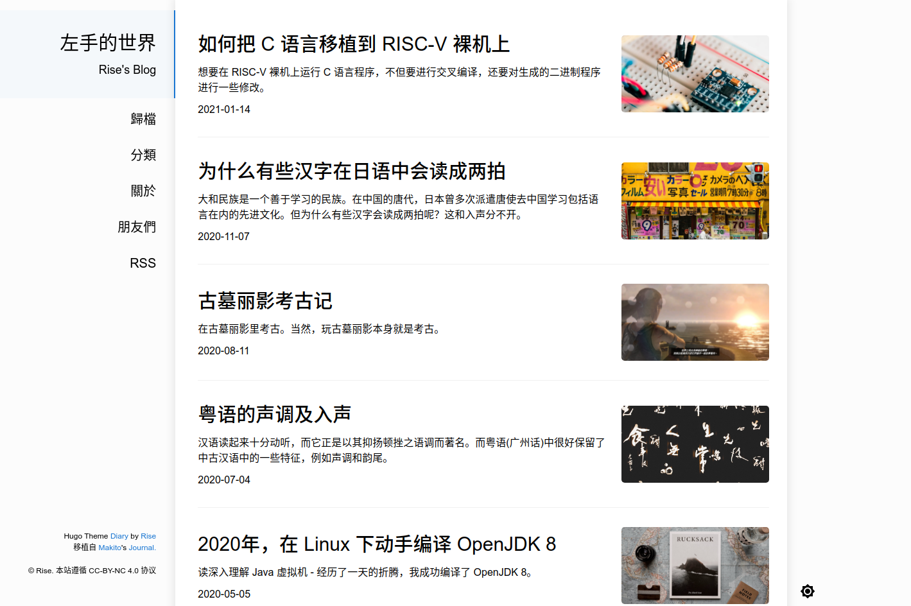
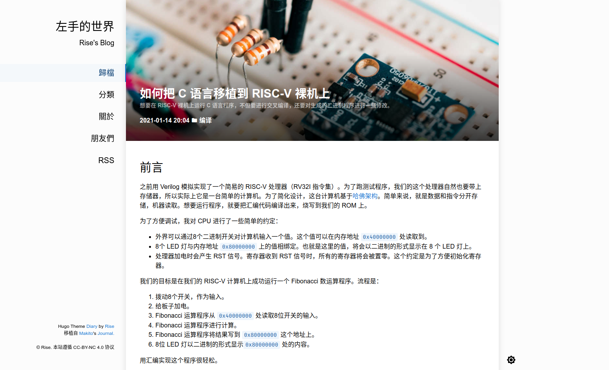
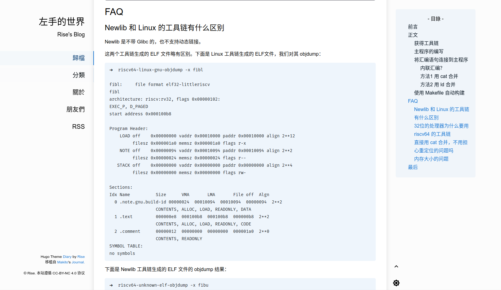
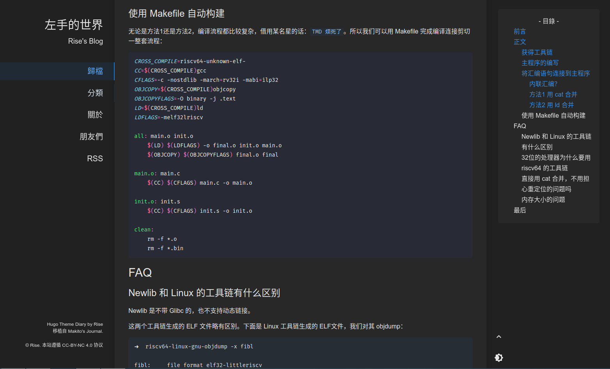
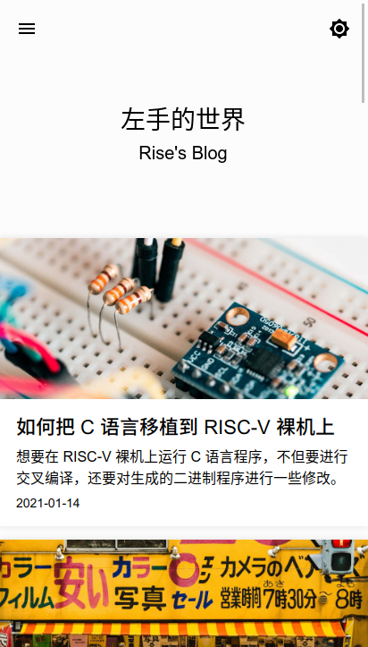
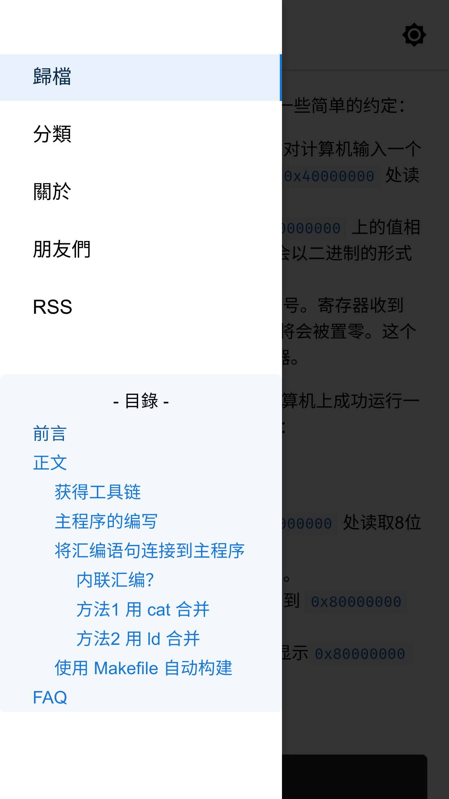

# <div align="center">Hugo Theme Diary</div>

<div align="center">


[My Blog with ✨Theme Diary✨](https://risehere.net/) -
[Intro Video](https://www.bilibili.com/video/av84273002) -
[Progress](https://github.com/AmazingRise/hugo-theme-diary/projects/) -
[Wiki](https://github.com/amazingrise/hugo-theme-diary/wiki)

隻言片語・於此匯聚

Moments piled up.

</div>

A Hugo theme ported from [SumiMakito/hexo-theme-Journal](https://github.com/SumiMakito/hexo-theme-Journal/).

## Features

### Features of this theme

- Customizable: Easy to customize with detailed project wiki.
- Adaptive: Mobile-friendly & widescreen-friendly.
- Abundant: 3rd. service intergration (Gitalk, LiveRe, Disqus, Waline, Twikoo, Google Search, Analytics... ).
- Convenient: Table of Contents with scroll spy.
- Professional: LaTeX support (disabled by default).
- Graceful: Dark mode (automatic or manual switch).
- International: English, Chinese (CHS/CHT), French, German, Portuguese(Brazil) support.
- ...

For details, please visit [project wiki](https://github.com/AmazingRise/hugo-theme-diary/wiki/).

### Features in new version

<details>
<summary>CHANGELOG</summary>

1.3.0:

- Removed jQuery and other redundant scripts.
- Some improvements on performance.

</details>

## Quick Start

<details>
<summary>Click to expand</summary>

If your website is using Git as version control, please do as follows:

1. Fetch the theme dir.

From the root of your Hugo site, open the terminal and execute:
```bash
git submodule add https://github.com/AmazingRise/hugo-theme-diary.git themes/diary
```
2. Update git repository.

Then update the git repository from the root of your site:
```bash
git submodule update --remote --merge
```

3. Run example site.

From the root of themes/diary/exampleSite:
```bash
hugo server --themesDir ../..
```

</details>

## Personalization

### Example config

See [/exampleSite/config.toml](https://github.com/AmazingRise/hugo-theme-diary/blob/main/exampleSite/config.toml)

### Customization

- [Wiki Home](https://github.com/AmazingRise/hugo-theme-diary/wiki)
- Configurations
  * [Internationalization(i18n)](https://github.com/AmazingRise/hugo-theme-diary/wiki/Internationalization)
  * [Sidebar](https://github.com/AmazingRise/hugo-theme-diary/wiki/Customization#customize-sidebar)
  * [Favicon](https://github.com/AmazingRise/hugo-theme-diary/wiki/Customization#add-favicon)
  * [Table Of Contents](https://github.com/AmazingRise/hugo-theme-diary/wiki/Table-Of-Contents)
  * [Enable/Disable Comment](https://github.com/AmazingRise/hugo-theme-diary/wiki/Comment-Area)
- 3rd. party services
  * [Comment Services](https://github.com/AmazingRise/hugo-theme-diary/wiki/Comment)
  * [Google Analytics](https://github.com/AmazingRise/hugo-theme-diary/wiki/Customization#add-google-analytics)
  * [Google Site Verification](https://github.com/AmazingRise/hugo-theme-diary/wiki/Customization#add-google-site-verification)
  * [Google Search Intergration](https://github.com/AmazingRise/hugo-theme-diary/wiki/Customization#add-google-search-box-on-your-site)
- Writing
  * [Meta Data](https://github.com/AmazingRise/hugo-theme-diary/wiki/Post's-meta-data)
  * [LaTeX Support](https://github.com/AmazingRise/hugo-theme-diary/wiki/MathJax)
  * [RSS Feed](https://github.com/AmazingRise/hugo-theme-diary/wiki/RSS-Feed)
  * [Inserting Figures](https://github.com/AmazingRise/hugo-theme-diary/wiki/Inserting-Figures)
- Styling
  * [Color Scheme](https://github.com/AmazingRise/hugo-theme-diary/wiki/Customization#change-color-scheme)
  * [Code Highlight](https://github.com/AmazingRise/hugo-theme-diary/wiki/Customization#about-highlight)
  * [Font Family](https://github.com/AmazingRise/hugo-theme-diary/wiki/Customization#change-default-font-scheme)
  * [Reading Time](https://github.com/AmazingRise/hugo-theme-diary/wiki/Reading-Time)
  * [Dark Mode](https://github.com/AmazingRise/hugo-theme-diary/wiki/Dark-Mode)
- [Troubleshooting](https://github.com/AmazingRise/hugo-theme-diary/wiki/Troubleshooting)


## Screenshots

<details>
<summary>Index Page</summary>



</details>

<details>
<summary>Post</summary>





</details>

<details>
<summary>Dark Mode</summary>



</details>

<details>
<summary>Mobile View</summary>





</details>


</details>
